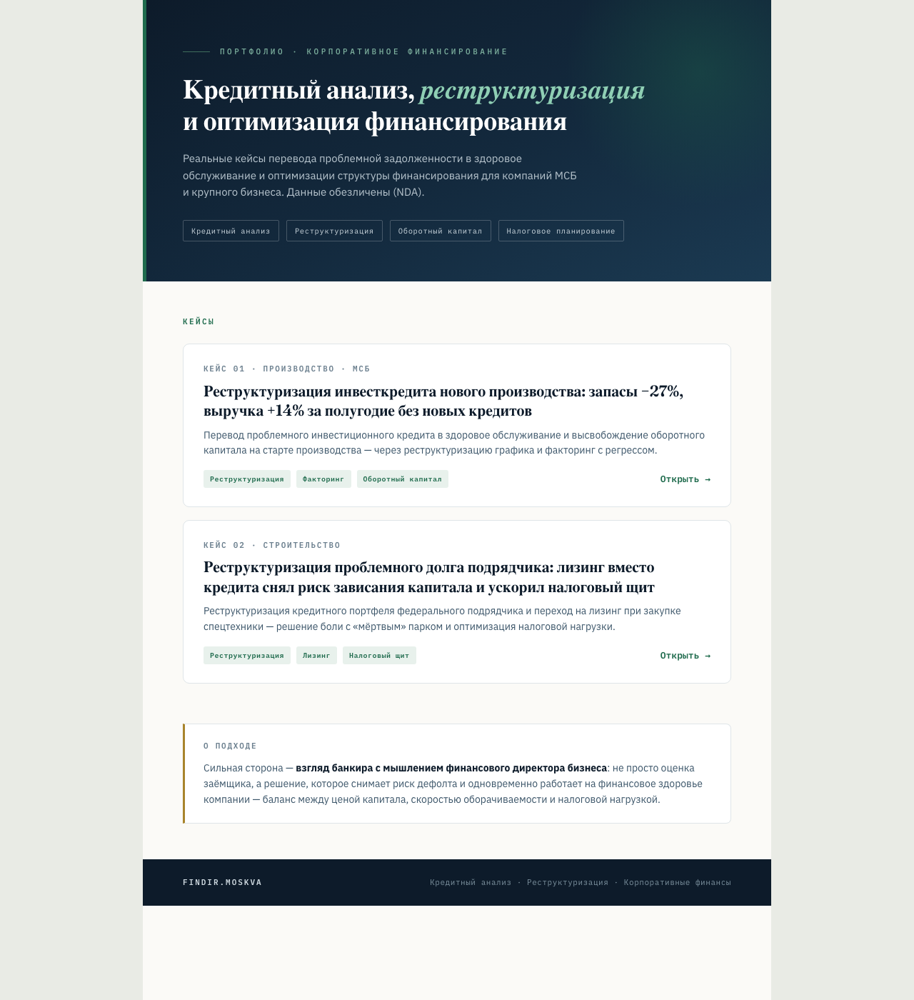

# Портфолио: кредитный анализ и реструктуризация

Сайт-портфолио финансового директора на аутсорсе — обезличенные кейсы из практики
кредитного анализа и корпоративного финансирования.

**Открыть:** [dabman1980.github.io/portfolio](https://dabman1980.github.io/portfolio)



## Какую задачу решает

Собственнику, который ищет внешнего финансового директора, недостаточно списка навыков —
ему нужно видеть, как выглядит результат работы. Сайт показывает два разобранных кейса:
что было на входе, какое решение принято и что изменилось в цифрах.

Данные компаний обезличены: названия скрыты, отрасли названы в общих формулировках.
Результат в каждом кейсе зависит от исходных данных конкретной компании.

## Кейсы

**Кейс 01 · производство, малый и средний бизнес.** Реструктуризация инвестиционного кредита
на старте производства: перевод проблемной задолженности в здоровое обслуживание через
изменение графика и факторинг с регрессом. Запасы сократились на 27%, выручка выросла
на 14% за полугодие без привлечения новых кредитов.

**Кейс 02 · строительство.** Реструктуризация кредитного портфеля федерального подрядчика
и переход на лизинг при закупке спецтехники вместо кредита — с расчётом налогового эффекта.

## Как устроено

Три статические страницы без сборки и зависимостей: главная со списком кейсов и по странице
на каждый кейс. Публикуется через GitHub Pages из ветки `main`.

```
index.html   — главная: позиционирование, карточки кейсов, блок о подходе
case1.html   — кейс 01: реструктуризация инвестиционного кредита
case2.html   — кейс 02: лизинг вместо кредита
```

Оформление — собственная вёрстка: тёмно-синий и приглушённый зелёный, шрифты Fraunces,
IBM Plex Sans и IBM Plex Mono, адаптив от 320 пикселей. Сторонних скриптов и счётчиков нет.

## Стек

`HTML5` · `CSS3` (без фреймворков) · `GitHub Pages`

## Запуск локально

Сборка не нужна — достаточно открыть файл в браузере:

```bash
git clone https://github.com/Dabman1980/portfolio.git
cd portfolio
open index.html          # Linux: xdg-open index.html
```

## Лицензия

Лицензия на личное использование — см. [LICENSE](LICENSE). Смотреть, изучать вёрстку и
использовать её как образец для себя — свободно; коммерческое использование текстов,
оформления и кейсов (в том числе как шаблона чужого сайта услуг) — по предварительному
письменному согласованию с автором.

## Автор

Дмитрий Борисюк — финансовый директор на аутсорсе, 20 лет в корпоративном кредитовании.
Связь: [@DmitryBorisyuk](https://t.me/DmitryBorisyuk) · канал: [@FindirMoscow](https://t.me/FindirMoscow)
